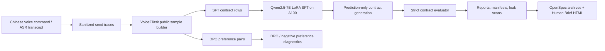

# Voice2Task Post-Training

[中文](README.md) | [English](README_en.md)


Voice2Task Post-Training is an evidence-first fine-tuning project for Chinese voice-to-browser task contracts. It turns Chinese spoken commands or ASR transcripts into safe, evaluable, reproducible browser task contract JSON, then keeps the whole path auditable through SFT/DPO data, 7B LoRA training gates, strict metrics, public-safe evidence packs, and OpenSpec archives.

The core question is intentionally narrow:

> Can a 7B model reliably convert natural Chinese browser intent into executable contract JSON, beyond memorizing the training format?

The current answer is conservative. The Qwen2.5-7B LoRA path runs on the private A100 environment and emits 100% schema-valid JSON on the current formal public sample, but strict full-contract exact match on the latest formal held-out evidence is only dev 0.3043 / test 0.2899. The infrastructure is real; the current bottleneck is residual route/task-type, safety-recall, and slot-exactness behavior, not another broad smoke run.

## TL;DR

- Input: Chinese voice commands, ASR transcripts, browser task intent.
- Output: strict-schema browser task contract JSON.
- Data: the committed formal public sample contains 77 seeds, 231 SFT rows, and 661 DPO preference pairs, split as train/dev/test = 93/69/69.
- Model path: Qwen2.5-7B-Instruct + LoRA. Training and prediction evidence comes from a private A100 runtime; weights and adapters are not committed.
- Latest public evidence: [`a100-formal-public-heldout-prediction`](reports/public-sample/a100-formal-public-heldout-prediction/report.md) is the current-manifest prediction-only dev/test evidence.
- Boundary: this repo proves that the data/training/prediction/eval path is real; it does not claim held-out recovery, production readiness, private-corpus generalization, live-browser benchmark gains, or a released checkpoint.

## Current Snapshot

| Item | Status |
| --- | --- |
| Public sample | 77 seeds, 231 SFT rows, 661 DPO pairs |
| Public split | train 93 / dev 69 / test 69 |
| Base model | Qwen/Qwen2.5-7B-Instruct |
| Adapter state | A100 merged slot-value adapter available for private prediction, not released |
| Latest evidence | formal public held-out prediction-only evaluation |
| Strict exact match | dev 0.3043 / test 0.2899 |
| JSON validity | dev 1.0000 / test 1.0000 |
| Interpretation | partial held-out signal; no recovery or release claim |

## Positioning

| This repo is | This repo is not |
| --- | --- |
| A speech/ASR-to-contract post-training experiment | A generic chat fine-tuning project |
| A strict JSON contract generation and evaluation pipeline | A GUI action policy or browser controller |
| An auditable SFT/DPO data, training, prediction, and evaluation workflow | A checkpoint or adapter release |
| A repository that separates train memorization from held-out generalization | A success story built on relaxed soft metrics |
| A public-safe evidence map | A dump of private data, SSH details, remote paths, or raw logs |

## Architecture



## What Is Implemented

| Area | Files |
| --- | --- |
| Dataset generation and validation | `src/voice2task/dataset.py`, `src/voice2task/validation.py`, `data/public-samples/` |
| Contract schema and evaluator | `src/voice2task/schemas.py`, `src/voice2task/evaluation.py` |
| SFT/DPO formatting | `src/voice2task/formatting.py`, `src/voice2task/dpo.py` |
| Training and prediction gates | `src/voice2task/training.py`, `configs/` |
| CLI surfaces | `src/voice2task/cli/data.py`, `src/voice2task/cli/train.py`, `src/voice2task/cli/eval.py`, `src/voice2task/cli/report.py` |
| Public-safe evidence | `reports/public-sample/`, `docs/human-briefs/`, `openspec/changes/archive/` |

## 3-Minute Reviewer Path

1. Read the current boundary: [`reports/public-sample/a100-formal-public-heldout-prediction/report.md`](reports/public-sample/a100-formal-public-heldout-prediction/report.md).
2. Inspect dev/test strict metrics: [`dev/metrics.md`](reports/public-sample/a100-formal-public-heldout-prediction/dev/metrics.md) and [`test/metrics.md`](reports/public-sample/a100-formal-public-heldout-prediction/test/metrics.md).
3. Inspect the formal public sample manifest: [`data/public-samples/manifest_public_sample.json`](data/public-samples/manifest_public_sample.json).
4. Skim the Chinese phase brief for this documentation refresh: [`docs/human-briefs/2026-06-15-refresh-project-visibility-report.html`](docs/human-briefs/2026-06-15-refresh-project-visibility-report.html).
5. Inspect the archived OpenSpec change: [`openspec/changes/archive/2026-06-15-evaluate-formal-public-sample-heldout-prediction/proposal.md`](openspec/changes/archive/2026-06-15-evaluate-formal-public-sample-heldout-prediction/proposal.md).

## Quick Start

Install local tooling:

```bash
python -m venv .venv
source .venv/bin/activate
pip install -e '.[dev,dataset]'
```

Rebuild and validate the committed public sample:

```bash
PYTHONPATH=src python -m voice2task.cli.data build-public \
  --seed data/public-samples/seed_traces.jsonl \
  --output data/public-samples

PYTHONPATH=src python -m voice2task.cli.data validate \
  --sft data/public-samples/sft_public_sample.jsonl \
  --dpo data/public-samples/dpo_public_sample.jsonl \
  --manifest data/public-samples/manifest_public_sample.json \
  --public
```

Run local baselines and metrics:

```bash
PYTHONPATH=src python -m voice2task.cli.eval baseline \
  --gold data/public-samples/sft_public_sample.jsonl \
  --output reports/public-sample/rule_baseline_predictions.jsonl

PYTHONPATH=src python -m voice2task.cli.eval metrics \
  --gold data/public-samples/sft_public_sample.jsonl \
  --predictions reports/public-sample/rule_baseline_predictions.jsonl \
  --output reports/public-sample
```

Run dry-run training metadata export:

```bash
PYTHONPATH=src python -m voice2task.cli.train sft \
  --config configs/sft-dev.json \
  --manifest data/public-samples/manifest_public_sample.json \
  --output-dir reports/public-sample/sft-dry-run \
  --dry-run

PYTHONPATH=src python -m voice2task.cli.train dpo \
  --config configs/dpo-dev.json \
  --manifest data/public-samples/manifest_public_sample.json \
  --output-dir reports/public-sample/dpo-dry-run \
  --dry-run
```

Heavy training is explicitly gated. A real SFT/DPO run requires both `--run-training` and a config with `allow_heavy_training: true`; unresolved template roots keep the run from starting.

## A100 Boundary

GPU-heavy training and prediction are designed for a private A100 development machine. Public repo artifacts intentionally omit:

- checkpoints, LoRA adapters, raw logs, remote caches, and model downloads;
- private corpus rows and full local seed exports;
- hostnames, SSH details, credentials, private paths, and private override configs;
- production-readiness, live-browser benchmark, private-corpus generalization, or checkpoint-release claims.

Prediction-only private runs should write sanitized public-sample outputs and metadata, then commit only aggregate reports, manifests, leak-scan results, and public-safe summaries.

## Evidence Map

| Evidence | What it proves | What it does not prove |
| --- | --- | --- |
| [`a100-formal-public-heldout-prediction`](reports/public-sample/a100-formal-public-heldout-prediction/report.md) | Current formal public manifest prediction-only dev/test evidence: JSON validity 1.0000, strict exact dev 0.3043 / test 0.2899 | Held-out recovery, model recovery, checkpoint release, production readiness |
| [`a100-merged-slot-value-adapter-restore`](reports/public-sample/a100-merged-slot-value-adapter-restore/report.md) | The private 7B adapter prerequisite was available/regenerated on A100 | Model recovery, checkpoint release, public adapter availability |
| [`a100-hardened-canonical-policy-rerun-observed`](reports/public-sample/a100-hardened-canonical-policy-rerun-observed/report.md) | Prediction-only rerun emitted schema-valid public-sample contracts and preserved strict metrics | Held-out recovery, evaluator relaxation, semantic scoring |
| [`a100-merged-slot-value-heldout-eval`](reports/public-sample/a100-merged-slot-value-heldout-eval/report.md) | Earlier merged slot-value adapter evaluation boundary | Production or full private-corpus generalization |
| [`docs/human-briefs/`](docs/human-briefs/) | Human-readable Chinese phase summaries | Source of truth for specs or metrics |
| [`openspec/changes/archive/`](openspec/changes/archive/) | Durable proposal/design/task history | Runtime evidence by itself |

## Metric Interpretation Boundaries

`contract_exact_match` is a hard full-contract exact-match metric. `normalized_command` string-mismatch diagnostics are explanatory row-level evidence only: they do not relax, normalize, semantically score, repair, replace, or re-score predictions, and they do not automatically mark Chinese phrase differences such as `搜索/查询` or `明天的天气/明天天气` as equivalent.

The latest formal public held-out result therefore reads as:

- JSON validity = 1.0000 on dev/test: schema-constrained output format is working;
- strict `contract_exact_match` = 0.3043 on dev and 0.2899 on test: full-contract held-out behavior is still partial;
- strict `slot_f1` = 0.3913 on dev and 0.5072 on test; `slot_f1_soft` = 0.7315 on dev and 0.7609 on test, but soft F1 is internal diagnostic only;
- route/task-type accuracy = 0.8551 on dev and 0.9130 on test, so residuals are not only slot wording differences.

## Normalized Command Target Policy

`normalized_command` gold targets are canonical Chinese intent phrases, not verbatim transcripts or ASR text. First-phase public samples use concise target phrases such as `搜索北京明天天气`, `打开示例网站`, `填写邮箱并确认`, and `拒绝代替用户付款`; schema-preserving paraphrases keep the same target contract. This is target-writing guidance for SFT/DPO data and prompts, not evaluator-side normalization, semantic-equivalence scoring, prediction repair, or re-scoring.

## Recommended Next Stage

The next useful phase is residual/family diagnosis rather than another broad rerun or immediate retraining:

1. inspect dev/test residual rows by family and field path across route, task type, safety, confirmation, and slots;
2. identify whether failures cluster in clarify, extract, blocked-payment, form-fill, or other families before adding data;
3. only then propose a bounded data or prompt-policy phase with train/dev/test family separation;
4. claim progress only if held-out `contract_exact_match` and relevant strict metrics improve without evaluator changes or prediction repair.

## Validation

Useful local checks:

```bash
PYTHONPATH=src pytest -q
OPENSPEC_TELEMETRY=0 openspec validate --all --strict
PYTHONPATH=src python -m voice2task.cli.report leak-scan README.md README_en.md reports/public-sample
git diff --check
```

## License

The package metadata declares an MIT license. A standalone `LICENSE` file should be added before presenting the repository as an open-source release.
